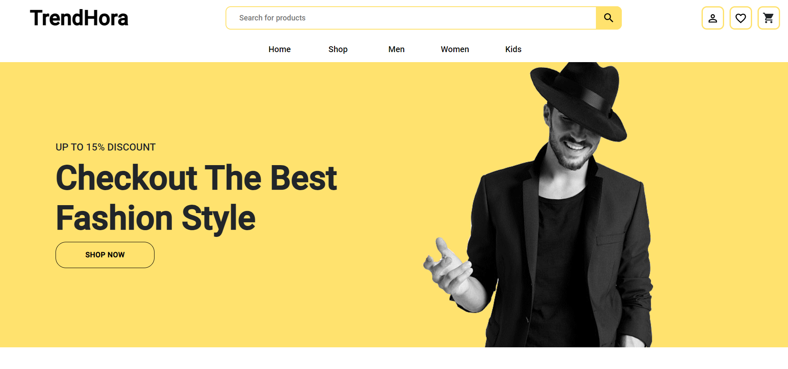

# Trendhora: A Cutting-Edge MERN Ecommerce Platform

Welcome to **Trendhora** – your gateway to a seamless online shopping experience. This full-stack ecommerce application harnesses the power of the MERN stack to bring you a dynamic and interactive marketplace. Whether you're a buyer exploring diverse product categories or an admin managing inventory and customer accounts, Trendhora offers a robust and feature-rich platform for all your ecommerce needs.



## 🌟 Features

### For Buyers
- 🛒 **Explore & Shop**: Browse through an extensive range of products across various categories.
- 📱 **User-Friendly Interface**: Enjoy a smooth shopping experience with an intuitive and responsive design.

### For Admins
- 🛠️ **Manage Marketplace**: Effortlessly control and update product listings.
- 👥 **Customer Account Management**: Handle customer accounts and ensure smooth operation of the marketplace.

## 🚀 Getting Started

### Prerequisites

Before you get started, make sure you have the following installed on your machine:
- **Node.js**: The runtime environment for running the application.
- **React.js**: The library used for building the frontend components.
- **MongoDB**: The NoSQL database that stores application data.
- **Express.js**: The framework used for routing and handling server requests.
- **Mongoose**: An ODM tool for MongoDB that helps model and interact with the database schema.

### Installation

1. **Clone the Repository**

   ```bash
   git clone https://github.com/your-repo/trendhora.git
   ```

2. **Set Up the Database**

Visit the MongoDB website to create a new database.
Create a collection named `Items` and insert the sample data provided in `server/ItemsCollection.js`.

3. **Configure the Environment**

In the `server` directory, create a `.env` file with the following configuration:

```
NODE_ENV=development
PORT=5000
MONGO_URI=mongodb+srv://<your-mongodb-uri>
```

## Running the Application
To start the application locally, you need to run both the frontend and backend servers.

1. **Start the Frontend**

Navigate to the client directory and run:
```
cd client
npm install
npm start
```

2. **Start the Backend**

Open another terminal, navigate to the server directory, and run:
```
cd server
npm install
npm run dev
```
3. **Add dummy data in database**
```
cd server
npm run seed
```

`Tip`: Run both terminals side-by-side to monitor the frontend and backend processes simultaneously.

## 🛠️ Technologies Used

* Node.js: JavaScript runtime for the server-side.
* React.js: Component-based library for building the user interface.
* Express.js: Web framework for handling server-side logic.
* MongoDB: NoSQL database for flexible data storage.
* Mongoose: ODM for MongoDB to simplify database operations.
* Material UI: Library for designing responsive and attractive user interfaces.

## Leave a Star 🌟 as well if you wanna support our project

## 🤝 Contributing

We welcome contributions to improve Trendhora. If you'd like to contribute, please fork the repository, make your changes, and submit a pull request. For more details on contributing, please refer to our [CONTRIBUTING.md](CONTRIBUTING.md).

## 📄 License

This project is licensed under the MIT License – see the [LICENSE.md](LICENSE) file for details.

## Project Admin Details
  
<a href="https://www.linkedin.com/in/agamjot-singh/" target="_blank">
  
</a>

<a href="https://x.com/_agamjotsingh" target="_blank">
  
</a>

  
<a href="https://github.com/agamjotsingh18" target="_blank">
  
</a>
